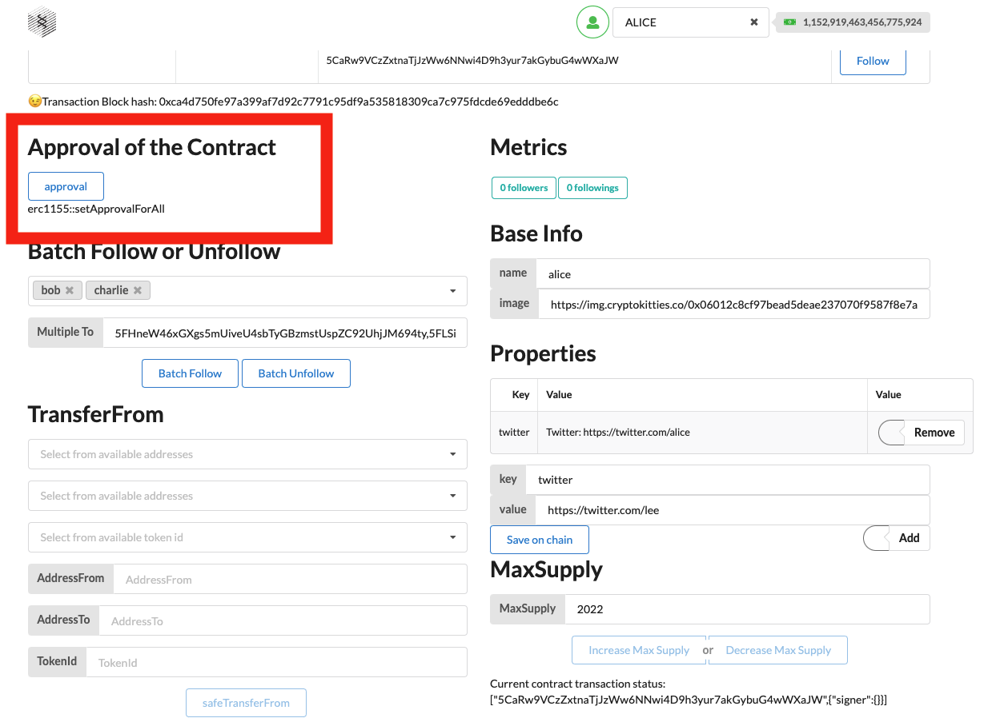

### How to follow my Web3. 0 friends?
1. Select the development test account, Following list.
 
2. Approve the contract before unfollow ,batch unfollow,transfer from ,batch transfer from.
    
3. Click [Follow]  . Or  Click [Unfollow] if current account  followed the account.
     
4. After the above steps are completed, you have successfully followed the account you are concerned about.
      
5. Click [Unfollow].
      
6. After the above steps are completed, you have successfully unfollowed the account you are concerned about.
   
7. Click [Batch Follow].
      
8. After the above steps are completed, you have successfully followed the accounts you are concerned about.
     
9.  Click [Batch unfollow].
      
10. After the above steps are completed, you have successfully unfollowed the accounts you are concerned about.
     
11.  The caller is the follower of  'to' required, 'from' has  the token id required,'to' has not  the token id required.Click [transfer from].
      
12. After the above steps are completed, you have successfully transferred the token id you are concerned about.
     
13. The caller is the follower of  'to' required, 'from' has  these token ids required,'to' has not  these token ids required.Click [Batch transfer from].
      
14. After the above steps are completed, you have successfully transferred the token ids you are concerned about.
     
