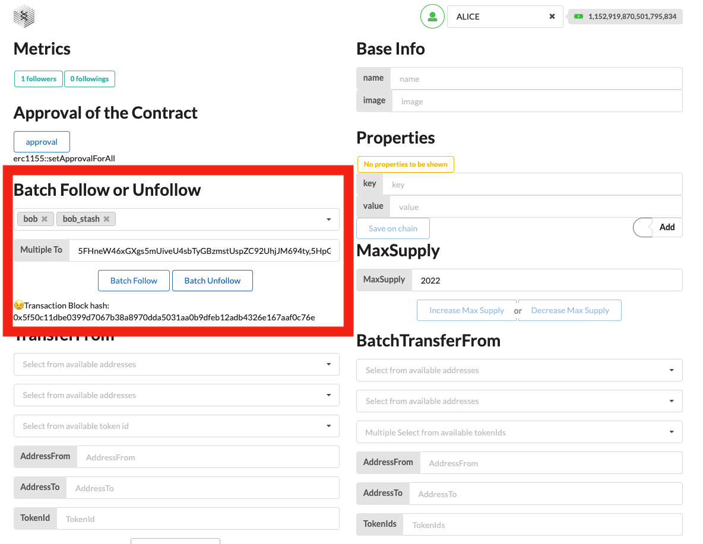

### How to follow my Web3.0 friends?

1. Select the development test account, Following list.
   
2. Approve the contract before unfollow ,batch unfollow,transfer from ,batch transfer from.
   
3. Click [Follow/Unfollow] if current account followed the account.
   
4. After the above steps are completed, you have successfully followed/unfollowed the account you are concerned about.
   
7. Click [Batch Follow] or [Batch unfollow].
   
8. After the above steps are completed, you have successfully followed  or  unfollowed the accounts you are concerned about.
    
11. Click [Transfer from].
 
11. Click [Batch Transfer from].
  
8. After the above steps are completed, you have successfully followed  or  unfollowed the accounts you are concerned about.
 

#### Note 
- The caller is the follower of 'to' required, 'from' has the token id required,'to' has not the token id required.Click [transfer from].
Considering that NFT is transferable which may lead to changes in relationships, we make the following restrictions in the HexSpace protocol to minimize invalid relationships.
- Receiver address ‘to’ must be not holding the current tokenId, or the transaction will be rolled back and export error – ‘HexSpace: already minted’
- Sender address ‘caller’ must be followed by receive address ‘to’, or the transaction will be rolled back and export error – ‘HexSpace: receiver hasn't minted sender's NFT’