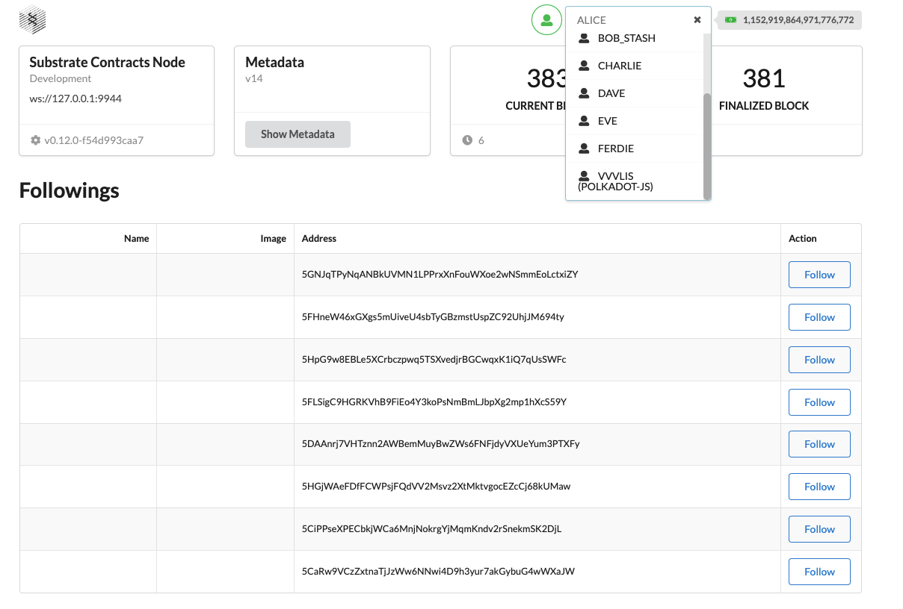

### How to edit the Profile on HexSpaceFrontEnd?
You need to select development test account .  create new account or import account by  `Polkadot JS Extension`  .
1. After you have selected your account, your meta.name will be displayed in the upper right side.
   
2. In My Profile Section, you can input your NFT image url as your Avatar. And you can enter your account name in the input box.
- image support multiple formats：
- If set NFT ERC721 or ERC1155： eip155:chainId+/+erc721/erc1155+:+contract+/tokenId 
- eg: eip155:56/erc721:0xC9A1757A52F2E87A2144c8b8Ec9CB075C8b50B35/199      eip155:1/erc1155:0xC9A1757A52F2E87A2144c8b8Ec9CB075C8b50B35/199
- If set ipfs: ipfs://xxxxxx or ipns://xxxxxx
- If set URL: http://xxxxxx or https://xxxxxx
- If set base64: data:image/png;base64,xxxxxx or data:image/jpeg;base64,xxxxxx or data:image/gif;base64,xxxxxx or data:image/x-icon;base64,xxxxxx
    
3. If you want to add properties like Twitter , after you have entered the key and value, click [Add].
-  suggest to use JSON and encode it to string through base64, which will help fast info extension.
    
4. Click [Save on chain] 
   
5. Increase Max Supply:  new max supply should be greater than the max supply . decrease Max Supply:  new max supply should be less than the max supply .
    
6.Click [InitNFTProfileimagesForTestAccountsOnDevMode]  Init NFT profile images for test accounts on dev mode.
    
