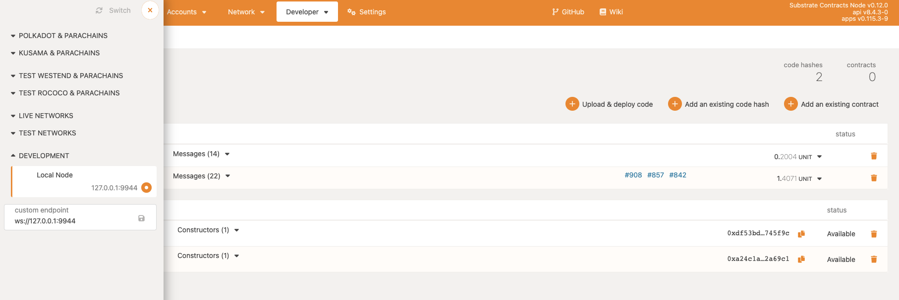
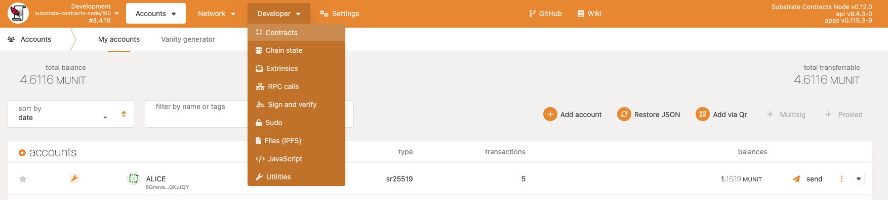
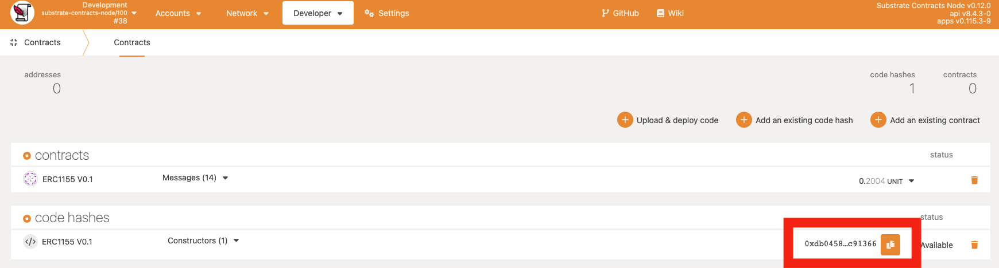
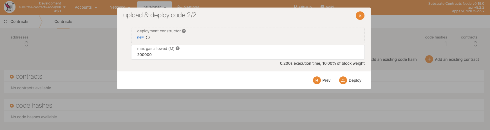
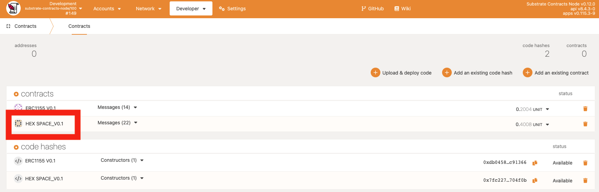
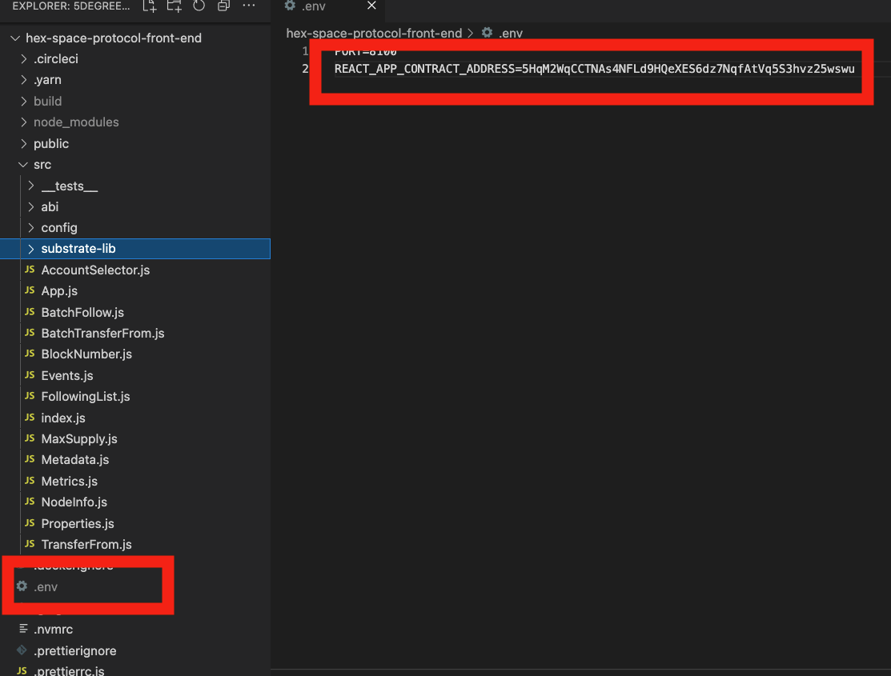

<!-- vscode-markdown-toc -->
* 1. [Install Rust and the Rust toolchain](#InstallRustandtheRusttoolchain)
* 2. [Setup HexSpaceSocialGraph Protocol Node](#SetupHexSpaceSocialGraphProtocolNode)
	* 2.1. [1. Installing The Substrate Contracts Node](#InstallingTheSubstrateContractsNode)
	* 2.2. [2. ink! CLI](#inkCLI)
		* 2.2.1. [cargo-contract](#cargo-contract)
	* 2.3. [3. Running a Substrate Smart Contracts Node](#RunningaSubstrateSmartContractsNode)
* 3. [Setup Contracts](#SetupContracts)
	* 3.1. [Get contracts](#Getcontracts)
* 4. [Compile contracts from source code](#Compilecontractsfromsourcecode)
* 5. [Testing contracts](#Testingcontracts)
* 6. [Deploy](#Deploy)
		* 6.1. [set the node IP and port ( `ws://127.0.0.1:9944` default).](#setthenodeIPandportws:127.0.0.1:9944default.)
		* 6.2. [Upload & Deploy contracts](#UploadDeploycontracts)
* 7. [Initialization & Deploy HexSpace](#InitializationDeployHexSpace)
* 8. [Install `Polkadot JS Extension`](#InstallPolkadotJSExtension)
	* 8.1. [Get source code](#Getsourcecode)
	* 8.2. [Config front-end](#Configfront-end)
		* 8.2.1. [1. Click Hex Space contract icon,copy the contract address.](#ClickHexSpacecontracticoncopythecontractaddress.)
		* 8.2.2. [2. Replace contract address of key 'REACT_APP_CONTRACT_ADDRESS' in .env](#ReplacecontractaddressofkeyREACT_APP_CONTRACT_ADDRESSin.env)
		* 8.2.3. [3. Replace connect path](#Replaceconnectpath)
	* 8.3. [Install dependencies](#Installdependencies)
	* 8.4. [Start front-end](#Startfront-end)
	* 8.5. [front-end  Test Guide](#front-endTestGuide)
* 9. [Acknowledgements](#Acknowledgements)
* 10. [Upstream](#Upstream)


<!-- vscode-markdown-toc-config
	numbering=true
	autoSave=true
	/vscode-markdown-toc-config -->
<!-- /vscode-markdown-toc -->
##  1. <a name='InstallRustandtheRusttoolchain'></a>Install Rust and the Rust toolchain

#####  1.Install `rustup` by running the following command: 

` curl https://sh.rustup.rs -sSf | sh `

##### 2.Configure your current shell to reload your PATH environment variable so that it includes the Cargo `bin` directory by running the following command: 

` source ~/.cargo/env `

##### 3.Configure the Rust toolchain to default to the latest `stable` version by running the following commands: 

`rustup default stable`

`rustup update`

##### 4. Add the `nightly` release and the `nightly` WebAssembly (`wasm`) targets by running the following commands: 

`rustup update nightly`

`rustup target add wasm32-unknown-unknown --toolchain nightly`

##### 5. Verify your installation by running the following commands: 

`rustc --version`
`rustup show`

##  2. <a name='SetupHexSpaceSocialGraphProtocolNode'></a>Setup HexSpaceSocialGraph Protocol Node

###  2.1. <a name='InstallingTheSubstrateContractsNode'></a>1. Installing The Substrate Contracts Node

 We need to use a Substrate node with the built-in `pallet-contracts` pallet. For this workshop we'll use a pre-configured Substrate node client. 

`cargo install contracts-node --git https://github.com/paritytech/substrate-contracts-node.git --tag v0.3.0 --force --locked`

###  2.2. <a name='inkCLI'></a>2. ink! CLI

```
# For Ubuntu or Debian users
sudo apt install 
# For MacOS users
brew install binaryen
```

####  2.2.1. <a name='cargo-contract'></a>cargo-contract

`cargo install cargo-contract --vers 0.15.0 --force --locked`

###  2.3. <a name='RunningaSubstrateSmartContractsNode'></a>3. Running a Substrate Smart Contracts Node

` substrate-contracts-node --dev  `


##  3. <a name='SetupContracts'></a>Setup Contracts

HexSpaceSocialGraph Protocol Contracts are provided in `https://github.com/rust-0x0/hex-space-protocol-substrate/tree/milestone-1`. 

It's developed with ink!.

###  3.1. <a name='Getcontracts'></a>Get contracts

```
git clone -b milestone-1 https://github.com/rust-0x0/hex-space-protocol-substrate.git
```


##  4. <a name='Compilecontractsfromsourcecode'></a>Compile contracts from source code

The HexSpaceSocialGraph-Protocol provides script to simplify the contract compilation process while collecting the editing results into a unified directory to facilitate contract deployment and usage. Execute in the project root directory

```bash
cd hex-space-protocol-substrate
bash ./build.sh
```

All contract compilation results are saved in the release directory.

##  5. <a name='Testingcontracts'></a>Testing contracts
Run the tests with:
```bash
cd  hex-space-protocol-substrate/hex-space
cargo test
```

##  6. <a name='Deploy'></a>Deploy

The HexSpaceSocialGraph Protocol creates the substrate chain to connect the POLKADOT Ecology, and all contracts are deployed on the HexSpaceSocialGraph dev node. This section explains how to make use of Polkadot JS App to deploy contracts.

Use `https://polkadot.js.org/apps/` upload .contract file to deploy contract.

####  6.1. <a name='setthenodeIPandportws:127.0.0.1:9944default.'></a>set the node IP and port ( `ws://127.0.0.1:9944` default).



####  6.2. <a name='UploadDeploycontracts'></a>Upload & Deploy contracts

Enter `Developer-> Contracts` and click Upload & deploy code.



Select the ERC1155 contract files that required to deploy contract.



After you upload the contracts,  click 'copy' icon copy erc1155 hash value.
 you can instantiate the contract on the chain. In substrate, you need to perform the contract’s initialization function, usually new or the default function.
Select the initialization function call, fill in the initialization parameters, set the main contract administrator, and set the contract initial balance, click `Deploy`. Click `Deploy `, and `Submit and Sign`

##  7. <a name='InitializationDeployHexSpace'></a>Initialization & Deploy HexSpace



# Setup HexSpaceSocialGraph Protocol Front-end

##  8. <a name='InstallPolkadotJSExtension'></a>Install `Polkadot JS Extension`

Please install `Polkadot JS Extension` before you start. You can get it from here https://polkadot.js.org/extension/

###  8.1. <a name='Getsourcecode'></a>Get source code

Please get the code from `https://github.com/rust-0x0/hex-space-protocol-front-end/tree/milestone-1`

```
git clone -b milestone-1 https://github.com/rust-0x0/hex-space-protocol-front-end.git
```

###  8.2. <a name='Configfront-end'></a>Config front-end

Please find the correct contract address in `example.env ` rename the file name to  '.env', and update the correct  contract address in   ```.env ```. 
####  8.2.1. <a name='ClickHexSpacecontracticoncopythecontractaddress.'></a>1. Click Hex Space contract icon,copy the contract address. 

####  8.2.2. <a name='ReplacecontractaddressofkeyREACT_APP_CONTRACT_ADDRESSin.env'></a>2. Replace contract address of key 'REACT_APP_CONTRACT_ADDRESS' in .env 



####  8.2.3. <a name='Replaceconnectpath'></a>3. Replace connect path

And replace `.env REACT_APP_PROVIDER_SOCKET` to your connect path.

it should be `ws://127.0.0.1:9944` by default.

###  8.3. <a name='Installdependencies'></a>Install dependencies

Run `yarn ` to install packages needed for this App.

###  8.4. <a name='Startfront-end'></a>Start front-end

`yarn start` runs the app in the development mode.
Open http://localhost:8100 to view it in the browser.

###  8.5. <a name='front-endTestGuide'></a>front-end  Test Guide

- [How to follow my Web3.0 friends Tutorial](./Follow.md)
- [How to edit the Profile on HexSpaceFrontEnd  Tutorial](./Profile.md)


##### Get gas from extension account

In `https://polkadot.js.org/apps` Account page, use account  send gas to your extension account.


##  9. <a name='Acknowledgements'></a>Acknowledgements

It is inspired by existing projects & standards:

- [5degrees](https://github.com/5DegreesProtocol/5degrees-protocol.git)


NOTE: This pallet implements the aforementioned process in a simplified way, thus it is intended for demonstration purposes and is not audited or ready for production use.

##  10. <a name='Upstream'></a>Upstream

This project was forked from
- [the Ink! Contract Example ERC115](https://github.com/paritytech/ink/tree/master/examples/erc1155)
- [the Substrate Contracts node](https://github.com/paritytech/substrate-contracts-node.git).
- [the Substrate DevHub Front-end Template](https://github.com/substrate-developer-hub/substrate-front-end-template)
